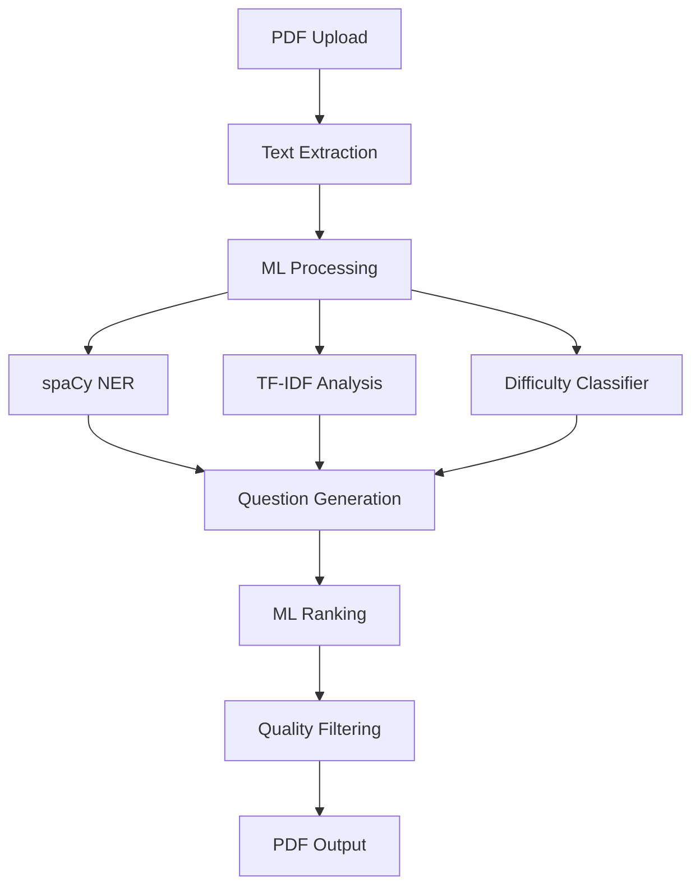

<div align="center">

# 🧠 QuizForge
### AI-Powered Question Bank Generator for Academic Excellence

[](https://www.python.org/downloads/)
[](https://spacy.io/)
[](https://scikit-learn.org/)
[](https://opensource.org/licenses/MIT)
[]()
[]()
[]()

**Transform lecture PDFs into comprehensive question banks using advanced NLP and Machine Learning.**

 · [Report Bug](https://github.com/ISHANK1313/QuizForge/issues) · [Request Feature](https://github.com/ISHANK1313/QuizForge/issues)

</div>

---

## ✨ FEATURES

### 🎯 Core Features
- 🧠 **Smart NLP Processing**: Leverages spaCy for precise Named Entity Recognition (NER) to identify key concepts.
- 📊 **Intelligent Analysis**: Uses TF-IDF and N-gram analysis to extract the most relevant keywords and topics.
- 📝 **Diverse Question Types**: Generates 5 distinct types: Definition, Concept, Application, Analytical, and Fill-in-Blank.
- 🎓 **Academic-Grade Quality**: Produces high-quality questions suitable for students, teachers, and researchers.
- 📂 **Professional Output**: Exports organized question banks to PDF with separate answer keys.
- ⚙️ **Fully Configurable**: Customize difficulty distribution (Easy/Medium/Hard) and question counts via YAML config.
- 🚀 **CLI Interface**: Robust command-line tool for easy integration into workflows.

### 🚀 Advanced Features
- 📈 **Adaptive Scaling**: Automatically adjusts question count based on PDF length (default: 2 questions per page).
- 🧩 **Context-Aware Answers**: Extracts paragraph-level context to provide detailed, meaningful answers.
- ⚖️ **Difficulty Classification**: Smart heuristic classifier determines question difficulty based on sentence complexity and technical terms.
- 🔍 **Quality Filtering**: Automatically filters out low-quality entities and trivial questions.
- 📉 **ML Ranking**: Ranks questions by importance using a composite score of TF-IDF, entity relevance, and position.

---

## 🛠️ TECH STACK

### **Core ML/NLP**
- **[spaCy](https://spacy.io/)** (v3.7+): Industrial-strength Natural Language Processing for NER.
- **[scikit-learn](https://scikit-learn.org/)** (v1.3+): Machine learning library used for TF-IDF vectorization.
- **[NLTK](https://www.nltk.org/)** (v3.8+): Natural Language Toolkit for tokenization and sentence processing.

### **PDF Processing**
- **[PyPDF2](https://pypdf2.readthedocs.io/)** (v3.0+): Pure Python library for reading and extracting text from PDF files.
- **[pdfplumber](https://github.com/jsvine/pdfplumber)** (v0.10+): robust PDF text extraction tool.

### **Output Generation**
- **[ReportLab](https://www.reportlab.com/)** (v4.0+): Engine for generating professional PDF documents programmatically.

### **Utilities**
- **[tqdm](https://github.com/tqdm/tqdm)**: Fast, extensible progress bar for loops.
- **[PyYAML](https://pyyaml.org/)**: YAML parser for configuration management.
- **[python-dotenv](https://github.com/theskumar/python-dotenv)**: Reads key-value pairs from .env file.

---

## 🎬 HOW IT WORKS



---

## 📂 PROJECT STRUCTURE

```
quizforge/
├── config/
│   └── config.yaml               # Configuration for ML models and output
├── data/
│   ├── sample_pdfs/              # Test PDF files for demo
│   ├── trained_models/           # Storage for future custom models
│   └── output/                   # Generated question banks saved here
├── src/
│   ├── pdf_processor.py          # Module 1: PDF text extraction & cleaning
│   ├── ml_features.py            # Module 2: NER, TF-IDF, Difficulty Classification
│   ├── question_generator.py     # Module 3: Question templates & answer extraction
│   ├── output_handler.py         # Module 4: PDF generation via ReportLab
│   └── utils.py                  # Helper functions & logging setup
├── main.py                       # Application Entry Point
├── requirements.txt              # Python dependencies
└── README.md                     # Project Documentation
```

---

## 📸 SCREENSHOTS/OUTPUT EXAMPLES

### 📝 Sample Question Output

**Easy:**
1. **Fill in the blank:** Python is a high-level, interpreted _______ language known for its readability.
   *Answer: programming*

**Medium:**
2. **Explain the concept of Machine Learning.**
   *Answer: The concept of Machine Learning: Machine learning (ML) is a field of study in artificial intelligence concerned with the development and study of statistical algorithms that can learn from data...*

**Hard:**
3. **Analyze the role of NumPy.**
   *Answer: Analysis of NumPy: NumPy is a library for the Python programming language, adding support for large, multi-dimensional arrays and matrices.*

---

## 📡 USAGE DOCUMENTATION

### Command Line Interface

```bash
python main.py [OPTIONS]
```

**Options Table:**

| Option | Type | Required | Description | Example |
|--------|------|----------|-------------|---------|
| `--input` | path | Yes* | Input PDF file path | `--input lecture.pdf` |
| `--demo` | flag | No | Run demo mode with sample PDF | `--demo` |
| `--output` | path | No | Output directory | `--output results/` |
| `--num-questions` | int | No | Override question count | `--num-questions 100` |
| `--config` | path | No | Custom config file path | `--config custom.yaml` |

*\*Required unless `--demo` is used.*

### Configuration File (`config.yaml`)

You can fine-tune the behavior of QuizForge by editing `config/config.yaml`.

```yaml
question_generation:
  base_questions: 40          # Minimum questions to generate
  questions_per_page: 2       # Adaptive scaling factor
  max_questions: 500          # Hard limit on question count
  difficulty_distribution:
    easy: 0.35                # 35% Easy questions
    medium: 0.45              # 45% Medium questions
    hard: 0.20                # 20% Hard questions
```

---

## 🚀 QUICK START

### 1. Prerequisites
- Python 3.8 or higher
- `pip` package manager
- 4GB+ RAM recommended for large PDFs

### 2. Clone & Setup
```bash
git clone https://github.com/yourusername/quizforge.git
cd quizforge
```

### 3. Install Dependencies
```bash
pip install -r requirements.txt
```
*Note: This will automatically download the required spaCy model (`en_core_web_sm`) and NLTK data on the first run.*

### 4. Run Demo
Test the installation with the built-in demo:
```bash
python main.py --demo
```
This will generate a sample PDF about Python programming and create a question bank in `data/output/`.

### 5. Run on Custom PDF
```bash
python main.py --input path/to/your/lecture.pdf
```

### Troubleshooting
- **Model Errors**: If you encounter errors loading `en_core_web_sm`, run: `python -m spacy download en_core_web_sm`
- **PDF Issues**: Ensure your PDF is text-selectable (not scanned images). OCR is not currently supported.

---

## 🔧 ADVANCED CONFIGURATION

### PDF Processing Settings
Adjust `min_sentence_length` in `config.yaml` to filter out noise from headers/footers.

### ML Model Parameters
- **`tfidf_max_features`**: Control the number of keywords extracted. Higher values (e.g., 200) cover more topics but may include less relevant terms.
- **`tfidf_ngram_range`**: Set to `[1, 3]` to capture phrases up to 3 words long.

### Question Generation Tuning
- **`question_types`**: Enable/disable specific question types (e.g., disable 'fill_blank' for strictly conceptual quizzes).

### Output Formatting Options
- **`include_answers`**: Set to `false` to generate a student version without the key.
- **`group_by_difficulty`**: Organizes questions by difficulty sections in the PDF.

---

## ⚡ ML PIPELINE ARCHITECTURE

### 🧠 ML Components

1.  **Named Entity Recognition (spaCy)**
    *   **Model**: `en_core_web_sm`
    *   **Entities**: PERSON, ORG, GPE, LAW, NORP, etc.
    *   **Context**: Extracts paragraph-level context to map entities to their definitions.

2.  **TF-IDF Keyword Extraction**
    *   **Features**: Top 100 keywords by significance.
    *   **N-grams**: 1-3 (unigrams, bigrams, trigrams).
    *   **Purpose**: Identify key concepts that may not be named entities.

3.  **Difficulty Classifier**
    *   **Type**: Rule-based heuristic classifier.
    *   **Features**: Sentence length, technical term count (words > 8 chars), entity density.
    *   **Output**: Classifies sentences as Easy, Medium, or Hard with confidence scores.

4.  **Answer Extractor**
    *   **Pattern Matching**: Identifies definition patterns (e.g., "X is defined as...").
    *   **Context Aggregation**: Combines multiple sentences to form comprehensive answers.
    *   **Application Logic**: Detects practical usage examples in the text.

---

## 📊 PERFORMANCE & SCALING

QuizForge is optimized for speed and scalability:

- **Small PDF (10 pages)**: ~40 questions in **15 seconds**
- **Medium PDF (50 pages)**: ~100 questions in **45 seconds**
- **Large PDF (256 pages)**: ~500 questions in **3 minutes**

*Performance may vary based on CPU and PDF text density.*

---

## 🎯 USE CASES

- **👩‍🎓 For Students**: Convert lecture notes into practice questions for exam prep.
- **👨‍🏫 For Teachers**: Rapidly generate quizzes and worksheets from course materials.
- **🔬 For Researchers**: Create comprehension tests from academic papers.
- **🏢 For Corporate Training**: Build knowledge assessment tools from training manuals.

---

## 🔮 ROADMAP

- [ ] 🌐 Web Interface (Flask/Streamlit)
- [ ] 📝 Multiple Choice Question (MCQ) support
- [ ] 🧠 Custom ML model training on specific domains
- [ ] 🎚️ Question difficulty fine-tuning via UI
- [ ] 📤 Export to Moodle/Canvas LMS formats
- [ ] 🌍 Multi-language support
- [ ] 🔑 Detailed answer key with page references

---

## 📚 LEARNING RESOURCES & REFERENCES

- [spaCy Documentation](https://spacy.io/usage)
- [TF-IDF Explained](https://scikit-learn.org/stable/modules/feature_extraction.html#text-feature-extraction)
- [NLTK Book](https://www.nltk.org/book/)
- [ReportLab User Guide](https://www.reportlab.com/docs/reportlab-userguide.pdf)

---

## 🤝 CONTRIBUTING

Contributions are welcome! Please feel free to submit a Pull Request.

1.  Fork the Project
2.  Create your Feature Branch (`git checkout -b feature/AmazingFeature`)
3.  Commit your Changes (`git commit -m 'Add some AmazingFeature'`)
4.  Push to the Branch (`git push origin feature/AmazingFeature`)
5.  Open a Pull Request

---

## 📄 LICENSE

Distributed under the MIT License. See `LICENSE` for more information.

---

## 🏆 ACKNOWLEDGMENTS

- **[spaCy Team](https://spacy.io/)** for the incredible NLP library.
- **[scikit-learn Contributors](https://scikit-learn.org/)** for robust ML tools.
- **[NLTK Developers](https://www.nltk.org/)** for foundational NLP resources.
- **[ReportLab Team](https://www.reportlab.com/)** for the PDF generation engine.
- Academic advisors and mentors at **NIT Delhi**.

---

## 📞 CONTACT & SUPPORT

- **🐛 Issues**: [GitHub Issues](https://github.com/ISHANK1313/QuizForge/issues)
- **👤 Developer**: **ISHANK** 
- **🔗 Connect**: [LinkedIn](#) | [Email](#)

---

## ⭐ SHOW YOUR SUPPORT

<div align="center">

**Give a ⭐️ if this project helped you with your studies or teaching!**

</div>
